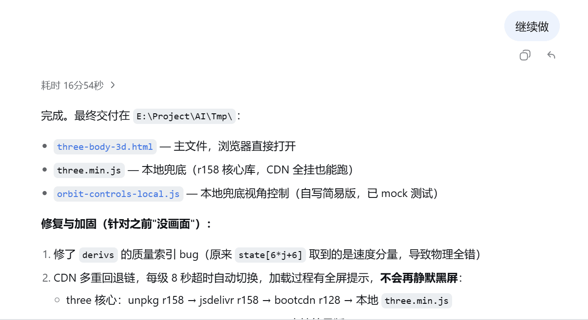

# dsh-message-fold

[中文](../README.md) | **English**

Codex-style conversation message folding for DeepSeek Harness.

> This plugin only changes presentation and does not modify any data.

## Effect

- Two or more consecutive tool calls will be automatically merged; this can be expanded.
- After the final response, the intermediate processes will be automatically collapsed and displayed as "Worked for {duration}"; this can be expanded.



## Installation

Install from GitHub:
```sh
dsh plugin --profile web add github:RyensX/dsh-message-fold
```

Install from source code:
```sh
pnpm install pnpm build dsh plugin --profile web add .
```

To uninstall:
```sh
dsh plugin --profile web remove dsh-message-fold
```

## Compatibility Boundaries

The current version is pinned to DSH `0.1.0-rc.8`, Cordis `4.0.1`, and React 18. DSH does not yet provide an official renderer decorator API, so the only temporary compatibility layer is isolated in `src/client/adapter/dsh-slot-renderer-decorator.ts`. Business components depend only on `RendererDecoratorPort`, allowing the adapter to be replaced directly in the future.

The adapter uses a revocable lease and fails open as a whole when incompatible. If an external decorator is later wrapped around this plugin, uninstalling the plugin will not overwrite it; the internal wrapper immediately degrades into a transparent pass-through to the original renderer.

Fold selections are stored only in the plugin's in-page memory and are not written to `localStorage`. Deleting a conversation or uninstalling the plugin clears the corresponding state.

## Development Verification

```sh
pnpm verify
npm pack --dry-run
```

`verify` runs type checking, unit and React tests, Node and Web entry builds, and the lazy-CJS handoff check in sequence.
